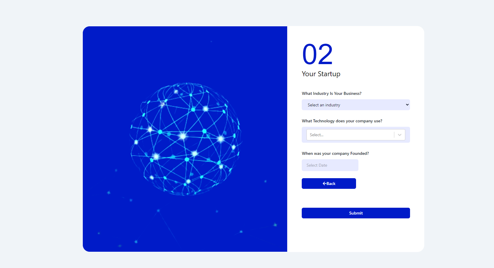

# VesterAI - Startup Onboarding Form Page One

# VesterAI - Startup Onboarding Form Page 2

## Welcome! 👋

This Project is a Technical Assessment for the position of a Full Stack Developer (FrontEnd Specialist) role at [Vidare](https://vidare.world/).
This assessment aims to evaluate my design and UX skills in developing a user-friendly and visually
appealing 2-page form for onboarding startups on the Vester.AI platform (a startup assessment tool).
Please read the instructions below carefully and complete the tasks within the specified time frame.

## Instructions: 

I am required to design a simple 2-page form for onboarding startups onto the
Vester.AI platform. The form should include the following questions:

Form Page 1:
- What is your startup's name?
- What is your startup's website?
- Where in Africa is your company legally registered?

Form Page 2:
- Which of these best describes your industry? (provide dropdown)
- What technology does your company mainly use? (provide dropdown and ability to
select all that apply)
- When was your company founded? (date selection)

## Test The Solution 
This Project was built with ❤ by Shekinah Manyi and deployed on Vercel and you can access it here :(https://vesterai-onboarding-form.vercel.app/) to test all Functionalities and the Solution in General

## ProJect SetUp
This project was bootstrapped with [Create React App](https://github.com/facebook/create-react-app).

The styling used for this Project is [TailwindCSS](https://tailwindcss.com/docs/installation)

Before you get started with the project, ensure you have node installed on your Machine!
Download the node modules after you cloning the project by using the command `npm install`
## Available Scripts

In the project directory, you can run:

### `npm start`

Runs the app in the development mode.\
Open [http://localhost:3000](http://localhost:3000) to view it in your browser.

The page will reload when you make changes.\
You may also see any lint errors in the console.

## Feedback
Feel Free to Leave a Feedback by Leaving a Star on this Project if you love it!

